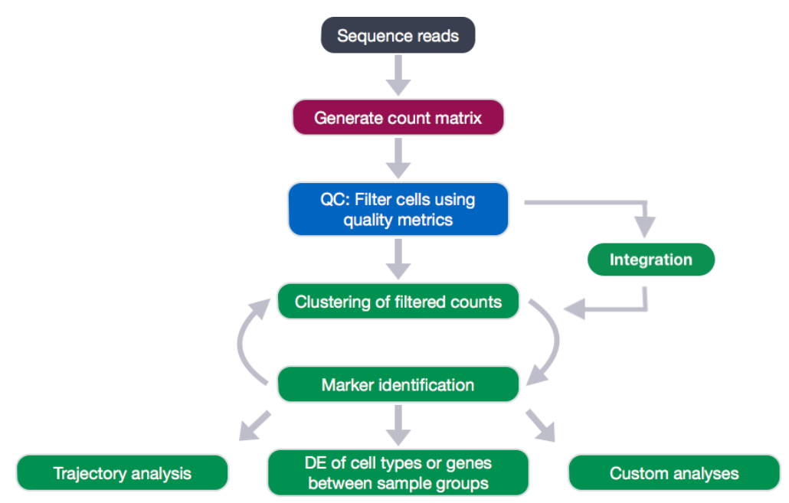

```{r setup, include=FALSE}
knitr::opts_chunk$set(echo = TRUE)
```



# Flujo de trabajo de **pre**procesamiento estándar

Preprocesamiento estándar para datos de scRNA-seq en Seurat. Estos representan la **selección** y el **filtrado de células** en función de métricas de control de calidad, la **NORMALIZACIÓN** y el **escalamiento de datos**, y la **detección de características altamente variables**.

########################################################################################################

Normalizando los datos

########################################################################################################


Después de eliminar las celdas no deseadas del conjunto de datos, el siguiente paso es **normalizar los datos**. 

La normalización es un paso crucial en el análisis de scRNA-seq que busca corregir las variaciones en la cantidad de ARN capturado entre diferentes células. Esto es importante porque las diferencias en la cantidad total de ARN en las células pueden influir en las mediciones de expresión génica, llevando a resultados engañosos.

De manera predeterminada, empleamos un método de normalización de escala global “LogNormalize” que normaliza las mediciones de expresión de características para cada celda por la expresión total, multiplica esto por un factor de escala (10 000 de manera predeterminada) y transforma logarítmicamente el resultado. 

(En Seurat v5, los valores normalizados se almacenan en formato pbmc[["RNA"]]$data)

```{r}
pbmc <- NormalizeData(pbmc, normalization.method = "LogNormalize", scale.factor = 10000)
```

Los parámetros como normalization.method y scale.factor tienen valores predeterminados. Si no se especifican, Seurat utilizará los valores por defecto, por lo tanto, se puede lograr el mismo comportamiento con:

```{r}
pbmc <- NormalizeData(pbmc)
```
