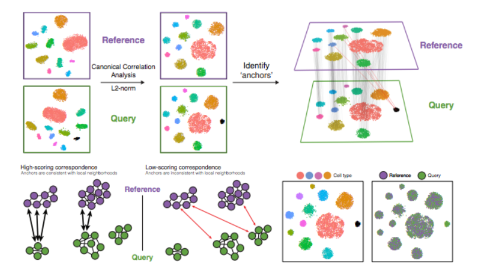

```{r setup, include=FALSE}
knitr::opts_chunk$set(echo = TRUE)
```

########################################################################################################

Itegrar muestras utilizando genes compartidos altamente variables

########################################################################################################


**Si las células se agrupan por muestra, condición, conjunto de datos o modalidad, este paso puede mejorar en gran medida la agrupación y los análisis posteriores.**

Se trata de un paso **OPCIONAL**

Puede resultar útil ejecutar primero las condiciones de forma individual si no está seguro de qué agrupaciones esperar o si espera algunos tipos de células diferentes entre las condiciones (por ejemplo, muestras tumorales y de control), y luego ejecutarlas juntas para ver si hay agrupaciones específicas de la condición para los tipos de células presentes en ambas condiciones. A menudo, cuando se agrupan células de múltiples condiciones, hay agrupaciones específicas de la condición y la integración puede ayudar a garantizar que los mismos tipos de células se agrupen.

Para integrar, utilizaremos los genes altamente variables compartidos de cada condición identificada mediante SCTransform, luego, “integraremos” o “armonizaremos” las condiciones para superponer células que sean similares o que tengan un “conjunto común de características biológicas” entre los grupos. Estos grupos pueden representar:

-  Diferentes condiciones (como ctrl y tratamiento)

-  Diferentes conjuntos de datos (por ejemplo, scRNA-seq de conjuntos de datos generados utilizando diferentes métodos de preparación de bibliotecas en las mismas muestras)

-  Diferentes modalidades (por ejemplo, scRNA-seq y scATAC-seq)


El objetivo de la integración es **garantizar que los tipos de células de una condición o conjunto de datos se alineen con los mismos tipos de células de las otras condiciones o conjuntos de datos** (por ejemplo, los macrófagos de control se alinean con los macrófagos estimulados).

En concreto, este método de integración espera “correspondencias” o estados biológicos compartidos entre al menos un subconjunto de células individuales de los grupos. Los pasos del análisis de integración se describen en la siguiente figura:



Los diferentes pasos que se aplican son los siguientes:

1. Realizar análisis de correlación canónica (CCA): Es una forma de análisis de componentes principales (PCA), ya que identifica las mayores fuentes de variación en los datos, pero solo si son compartidas o conservadas entre las condiciones o grupo.

2. Identifique anclas o vecinos mutuos más cercanos (MNN) en los conjuntos de datos (a veces se identifican anclas incorrectas)

3. Filtrar anclas para eliminar anclas incorrectas.

4. Integrar las condiciones/conjuntos de datos: Utilice anclas y puntuaciones correspondientes para transformar los valores de expresión celular, lo que permite la integración de las condiciones/conjuntos de datos.


**Si los tipos de células están presentes en un conjunto de datos, pero no en el otro, las células seguirán apareciendo como un grupo separado y específico de la muestra.**


```{r}
# Split seurat object by condition to perform cell cycle scoring and SCT on all samples
split_seurat <- SplitObject(filtered_seurat, split.by = "sample")

split_seurat <- split_seurat[c("ctrl", "stim")]

for (i in 1:length(split_seurat)) {
    split_seurat[[i]] <- NormalizeData(split_seurat[[i]], verbose = TRUE)
    split_seurat[[i]] <- CellCycleScoring(split_seurat[[i]], g2m.features=g2m_genes, s.features=s_genes)
    split_seurat[[i]] <- SCTransform(split_seurat[[i]], vars.to.regress = c("mitoRatio"))
    }
```

```{r}
# Check which assays are stored in objects
split_seurat$ctrl@assays
```

En primer lugar, debemos especificar que queremos utilizar los 3000 genes más variables identificados por SCTransform para la integración. De forma predeterminada, esta función solo selecciona los 2000 genes principales.

```{r}
# Select the most variable features to use for integration
integ_features <- SelectIntegrationFeatures(object.list = split_seurat, 
                                            nfeatures = 3000) 
```

Luego, necesitamos **preparar el objeto SCTransform** para la integración.

```{r}
# Prepare the SCT list object for integration
split_seurat <- PrepSCTIntegration(object.list = split_seurat, 
                                   anchor.features = integ_features)
```


Ahora, vamos a **realizar CCA, encontrar los mejores amigos o anclas y filtrar las anclas incorrectas** . Para nuestro conjunto de datos, esto tardará hasta 15 minutos en ejecutarse. Además, tenga en cuenta que la barra de progreso en su consola permanecerá en 0 %, pero sepa que realmente se está ejecutando.

```{r}
# Find best buddies - can take a while to run
integ_anchors <- FindIntegrationAnchors(object.list = split_seurat, 
                                        normalization.method = "SCT", 
                                        anchor.features = integ_features)
```


Finalmente, podemos **integrar entre condiciones**.

```{r}
# Integrate across conditions
seurat_integrated <- IntegrateData(anchorset = integ_anchors, 
                                   normalization.method = "SCT")
```


Este suele ser un buen lugar para guardar el objeto R.

```{r}
# Save integrated seurat object
saveRDS(seurat_integrated, "results/integrated_seurat.rds")
```


# VISUALIZACIÓN

Después de la integración, para visualizar los datos integrados podemos utilizar técnicas de reducción de dimensionalidad, como PCA y Aproximación y Proyección de Variedad Uniforme (UMAP). 

Mientras que PCA determinará todos los PC, solo podemos representar gráficamente dos a la vez. Por el contrario, UMAP tomará la información de cualquier número de PC superiores para organizar las celdas en este espacio multidimensional. 


Empecemos con PCA.

```{r}
# Run PCA
seurat_integrated <- RunPCA(object = seurat_integrated)

# Plot PCA
PCAPlot(seurat_integrated,
        split.by = "sample")  
```

La idea es que se superpongan.

Ahora también podemos visualizar con UMAP. Ejecutemos el método y tracemos el gráfico.


```{r}
# Run UMAP
seurat_integrated <- RunUMAP(seurat_integrated, 
                             dims = 1:40,
			     reduction = "pca")

# Plot UMAP                             
DimPlot(seurat_integrated)    
```


A veces es más fácil ver si todas las celdas se alinean bien si dividimos el gráfico entre las condiciones , lo que podemos hacer agregando el split.byargumento a la DimPlot()función:

 
```{r}
DimPlot(seurat_integrated,
        split.by = "sample") 
```


